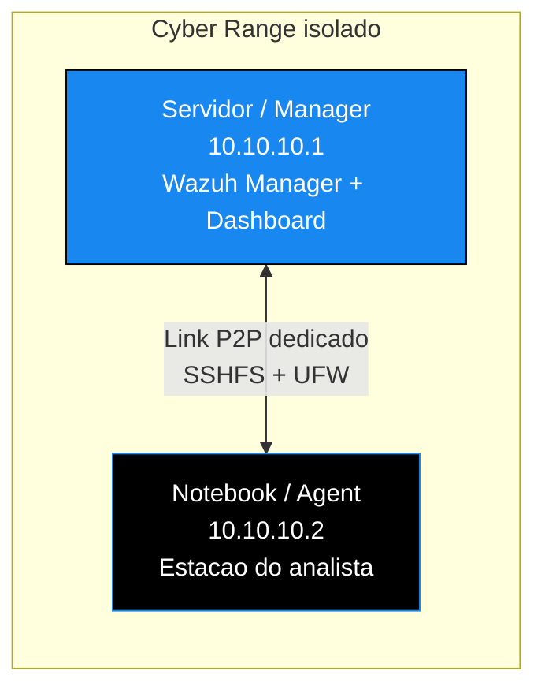

<!-- ══════════════════════ IDIOMAS / LANGUAGES ══════════════════════ -->
<div align="center">
<a href="README.md"></a>
<a href="README.en.md"></a>
<a href="README.es.md"></a>
</div>

<!-- ══════════════════════════ BANNER ══════════════════════════ -->
<div align="center">
  
</div>

<div align="center">
  
</div>

<div align="center">
  
</div>

<br/>

<div align="center">
  <a href="https://github.com/douglascshun/ConfigDeLabP2P">
    
  </a>
</div>

<h1 align="center">Cyber Range P2P</h1>
<p align="center"><em>An isolated, fast security lab monitored in real time, with no passwords typed along the way.</em></p>
<p align="center"><strong>Point-to-point link · persistent mount with SSHFS · monitoring with Wazuh</strong></p>

<div align="center">


<br/>


</div>

<!-- ══════════════════════════ NAVEGAÇÃO ══════════════════════════ -->
<div align="center">

<a href="#visao-geral"></a>
<a href="#beneficios"></a>
<a href="#arquitetura"></a>
<a href="#roadmap"></a>
<a href="#implementacao"></a>

</div>

<br/>

> **Repository under construction.** The full guide is being documented and published stage by stage. The roadmap below is an honest view of what is already done and what is still to come.

<!-- ══════════════════════════ VISÃO GERAL ══════════════════════════ -->
<a id="visao-geral"></a>
## Overview

This repository documents how to build a Cyber Range, a fully isolated, fast, automated security lab monitored in real time.

The core goal is to put an end to three manual, risky habits: the constant use of `scp` and `sftp` with a typed password, the exposure of critical services on the main Wi-Fi network, and the lack of visibility into the security server itself. In their place come a dedicated point-to-point network, a persistent SSHFS mount with key-based authentication, and full monitoring with Wazuh that reaches even the Manager itself.

<div align="center">
  
</div>

<!-- ══════════════════════════ BENEFÍCIOS ══════════════════════════ -->
<a id="beneficios"></a>
## Benefits and problems solved

<div align="center">

| Old problem | Implemented solution | Final benefit |
|:--|:--|:--|
| Services exposed on the main Wi-Fi network | Isolated P2P link with a restrictive UFW | Total isolation, maximum speed and minimal attack surface |
| Constant use of `scp`, `sftp` and passwords | Persistent SSHFS with an SSH key | Remote files accessed as if they were local |
| No visibility into the Manager itself | Wazuh Agent 000 (localhost) and P2P Agent | Monitoring of the whole environment, including the server |

</div>

<div align="center">
  
</div>

<!-- ══════════════════════════ ARQUITETURA ══════════════════════════ -->
<a id="arquitetura"></a>
## Architecture



<div align="center">

| Machine | Role | IP (example) | OS |
|:--|:--|:--:|:--:|
| Server (Manager) | Wazuh Manager, Dashboard and work environment | `10.10.10.1` | Kali / Debian |
| Laptop (Agent) | Analyst or pentester machine | `10.10.10.2` | Kali / Debian |

</div>

**Prerequisites (already installed on both machines):** Wazuh Manager and Dashboard on the server, Wazuh Agent on the laptop, `sshfs` on both ends, `ufw` active on the server and a shared mouse and keyboard solution (Deskflow, Barrier or Input Leap).

<div align="center">
  
</div>

<!-- ══════════════════════════ ROADMAP ══════════════════════════ -->
<a id="roadmap"></a>
## Implementation roadmap

The guide is split into five stages. As each one is validated in practice, it is published here.

- [x] **Stage 1 · Point-to-point link (P2P).** Static IP setup on both machines. Published below.
- [ ] **Stage 2 · Persistent SSHFS.** Automatic key-based mount that survives a reboot.
- [ ] **Stage 3 · UFW rules.** Allow only the P2P peer and block the rest.
- [ ] **Stage 4 · Wazuh integration.** Agent on the laptop and Agent 000 on the Manager itself.
- [ ] **Stage 5 · Shared mouse and keyboard.** Deskflow between the two machines.

<div align="center">
  
</div>

<!-- ══════════════════════════ IMPLEMENTAÇÃO ══════════════════════════ -->
<a id="implementacao"></a>
## Implementation guide

<details open>
<summary><b>Stage 1 · Point-to-point link (P2P)</b></summary>

<br/>

**On the server (`10.10.10.1`)**

```bash
sudo nano /etc/network/interfaces
```

Add these lines to the file:

```
auto eth0
iface eth0 inet static
    address 10.10.10.1
    netmask 255.255.255.0
```

The analyst machine uses the same configuration, changing the address to `10.10.10.2`.

</details>

<details>
<summary><b>Stages 2 to 5</b> coming soon</summary>

<br/>

Agent setup, persistent SSHFS, UFW rules, full Wazuh integration and shared mouse and keyboard. The content lands here as soon as each stage is validated.

</details>

<div align="center">
  
</div>

<div align="center">
<a href="https://github.com/douglascshun"></a>
<a href="https://www.linkedin.com/in/douglas-cshunderlick/"></a>
<a href="mailto:douglascshun@gmail.com"></a>
</div>

<br/>

<div align="center"><a href="#visao-geral"></a></div>
