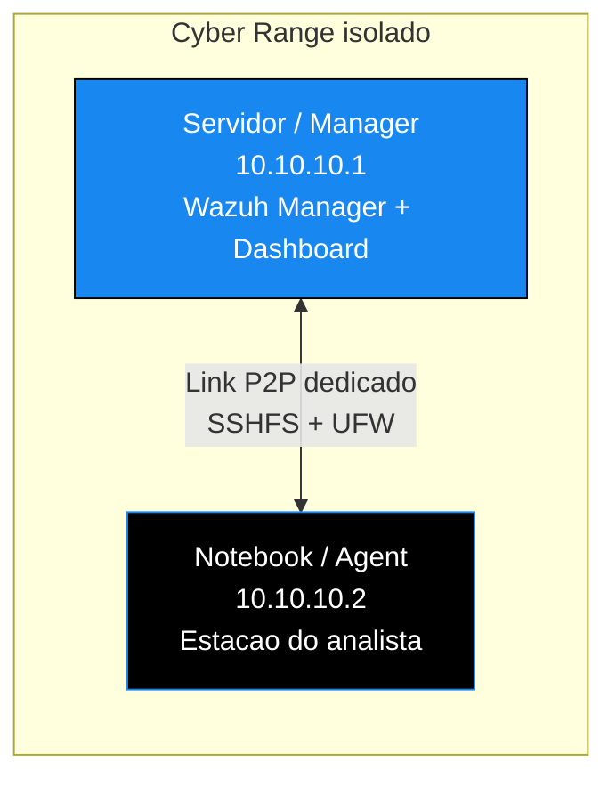

<!-- ══════════════════════ IDIOMAS / LANGUAGES ══════════════════════ -->
<div align="center">
<a href="README.md"></a>
<a href="README.en.md"></a>
<a href="README.es.md"></a>
</div>

<!-- ══════════════════════════ BANNER ══════════════════════════ -->
<div align="center">
  
</div>

<div align="center">
  
</div>

<div align="center">
  
</div>

<br/>

<div align="center">
  <a href="https://github.com/douglascshun/ConfigDeLabP2P">
    
  </a>
</div>

<h1 align="center">Cyber Range P2P</h1>
<p align="center"><em>Laboratorio de seguridad aislado, rápido y monitorizado en tiempo real, sin contraseñas escritas por el camino.</em></p>
<p align="center"><strong>Enlace punto a punto · montaje persistente con SSHFS · monitorización con Wazuh</strong></p>

<div align="center">


<br/>


</div>

<!-- ══════════════════════════ NAVEGAÇÃO ══════════════════════════ -->
<div align="center">

<a href="#visao-geral"></a>
<a href="#beneficios"></a>
<a href="#arquitetura"></a>
<a href="#roadmap"></a>
<a href="#implementacao"></a>

</div>

<br/>

> **Repositorio en construcción.** La guía completa se está documentando y publicando por etapas. La hoja de ruta de abajo muestra con honestidad lo que ya está listo y lo que todavía falta.

<!-- ══════════════════════════ VISÃO GERAL ══════════════════════════ -->
<a id="visao-geral"></a>
## Visión general

Este repositorio documenta cómo montar un Cyber Range, un laboratorio de seguridad totalmente aislado, rápido, automatizado y monitorizado en tiempo real.

El objetivo central es acabar de una vez con tres prácticas manuales y arriesgadas: el uso constante de `scp` y `sftp` con contraseña escrita, la exposición de servicios críticos en la red Wi-Fi principal y la falta de visibilidad sobre el propio servidor de seguridad. En su lugar entran una red punto a punto dedicada, un montaje persistente vía SSHFS con autenticación por clave, y una monitorización completa con Wazuh que alcanza hasta el propio Manager.

<div align="center">
  
</div>

<!-- ══════════════════════════ BENEFÍCIOS ══════════════════════════ -->
<a id="beneficios"></a>
## Beneficios y problemas resueltos

<div align="center">

| Problema antiguo | Solución implementada | Beneficio final |
|:--|:--|:--|
| Servicios expuestos en la red Wi-Fi principal | Enlace P2P aislado con un UFW restrictivo | Aislamiento total, velocidad máxima y superficie de ataque mínima |
| Uso constante de `scp`, `sftp` y contraseñas | SSHFS persistente con una clave SSH | Archivos remotos accedidos como si fueran locales |
| Sin visibilidad sobre el propio Manager | Wazuh Agent 000 (localhost) y Agent P2P | Monitorización de todo el entorno, incluido el servidor |

</div>

<div align="center">
  
</div>

<!-- ══════════════════════════ ARQUITETURA ══════════════════════════ -->
<a id="arquitetura"></a>
## Arquitectura



<div align="center">

| Máquina | Función | IP (ejemplo) | SO |
|:--|:--|:--:|:--:|
| Servidor (Manager) | Wazuh Manager, Dashboard y entorno de trabajo | `10.10.10.1` | Kali / Debian |
| Portátil (Agent) | Máquina del analista o pentester | `10.10.10.2` | Kali / Debian |

</div>

**Requisitos previos (ya instalados en ambas máquinas):** Wazuh Manager y Dashboard en el servidor, Wazuh Agent en el portátil, `sshfs` en ambos extremos, `ufw` activo en el servidor y una solución de ratón y teclado compartidos (Deskflow, Barrier o Input Leap).

<div align="center">
  
</div>

<!-- ══════════════════════════ ROADMAP ══════════════════════════ -->
<a id="roadmap"></a>
## Hoja de ruta de implementación

La guía se divide en cinco etapas. A medida que cada una se valida en la práctica, se publica aquí.

- [x] **Etapa 1 · Enlace punto a punto (P2P).** Configuración de IP estática en ambas máquinas. Publicada abajo.
- [ ] **Etapa 2 · SSHFS persistente.** Montaje automático por clave que sobrevive a un reinicio.
- [ ] **Etapa 3 · Reglas de UFW.** Permitir solo el par P2P y bloquear el resto.
- [ ] **Etapa 4 · Integración con Wazuh.** Agent en el portátil y Agent 000 en el propio Manager.
- [ ] **Etapa 5 · Ratón y teclado compartidos.** Deskflow entre las dos máquinas.

<div align="center">
  
</div>

<!-- ══════════════════════════ IMPLEMENTAÇÃO ══════════════════════════ -->
<a id="implementacao"></a>
## Guía de implementación

<details open>
<summary><b>Etapa 1 · Enlace punto a punto (P2P)</b></summary>

<br/>

**En el servidor (`10.10.10.1`)**

```bash
sudo nano /etc/network/interfaces
```

Añade estas líneas al archivo:

```
auto eth0
iface eth0 inet static
    address 10.10.10.1
    netmask 255.255.255.0
```

La máquina del analista usa la misma configuración, cambiando la dirección a `10.10.10.2`.

</details>

<details>
<summary><b>Etapas 2 a 5</b> próximamente</summary>

<br/>

Configuración del Agent, SSHFS persistente, reglas de UFW, integración completa con Wazuh y uso compartido de ratón y teclado. El contenido aparece aquí en cuanto cada etapa se valida.

</details>

<div align="center">
  
</div>

<div align="center">
<a href="https://github.com/douglascshun"></a>
<a href="https://www.linkedin.com/in/douglas-cshunderlick/"></a>
<a href="mailto:douglascshun@gmail.com"></a>
</div>

<br/>

<div align="center"><a href="#visao-geral"></a></div>
