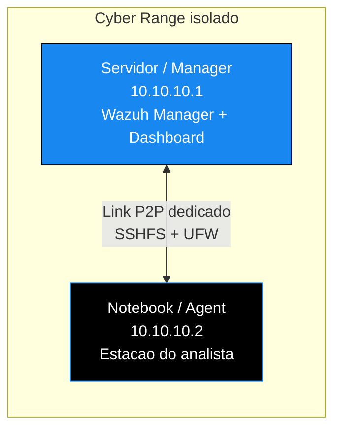

<!-- ══════════════════════ IDIOMAS / LANGUAGES ══════════════════════ -->
<div align="center">
<a href="README.md"></a>
<a href="README.en.md"></a>
<a href="README.es.md"></a>
</div>

<!-- ══════════════════════════ BANNER ══════════════════════════ -->
<div align="center">
  
</div>

<div align="center">
  
</div>

<div align="center">
  
</div>

<br/>

<div align="center">
  <a href="https://github.com/douglascshun/ConfigDeLabP2P">
    
  </a>
</div>

<h1 align="center">Cyber Range P2P</h1>
<p align="center"><em>Laboratório de segurança isolado, rápido e monitorado em tempo real, sem senhas digitadas no caminho.</em></p>
<p align="center"><strong>Link ponto a ponto · montagem persistente com SSHFS · monitoramento com Wazuh</strong></p>

<div align="center">


<br/>


</div>

<!-- ══════════════════════════ NAVEGAÇÃO ══════════════════════════ -->
<div align="center">

<a href="#visao-geral"></a>
<a href="#beneficios"></a>
<a href="#arquitetura"></a>
<a href="#roadmap"></a>
<a href="#implementacao"></a>

</div>

<br/>

> **Repositório em construção.** O guia completo está sendo documentado e publicado por etapas. O roadmap abaixo mostra com honestidade o que já está pronto e o que ainda vem.

<!-- ══════════════════════════ VISÃO GERAL ══════════════════════════ -->
<a id="visao-geral"></a>
## Visão geral

Este repositório documenta como montar um Cyber Range, um laboratório de segurança totalmente isolado, rápido, automatizado e monitorado em tempo real.

O ponto central é eliminar de vez três práticas manuais e arriscadas: o uso constante de `scp` e `sftp` com senha digitada, a exposição de serviços críticos na rede Wi-Fi principal e a falta de visibilidade sobre o próprio servidor de segurança. No lugar delas entram uma rede ponto a ponto dedicada, montagem persistente via SSHFS com autenticação por chave, e monitoramento completo com Wazuh cobrindo até o próprio Manager.

<div align="center">
  
</div>

<!-- ══════════════════════════ BENEFÍCIOS ══════════════════════════ -->
<a id="beneficios"></a>
## Benefícios e problemas resolvidos

<div align="center">

| Problema antigo | Solução implementada | Benefício final |
|:--|:--|:--|
| Serviços expostos na rede Wi-Fi principal | Link P2P isolado com UFW restritivo | Isolamento total, velocidade máxima e superfície de ataque mínima |
| Uso constante de `scp`, `sftp` e senhas | SSHFS persistente com chave SSH | Arquivos remotos acessados como se fossem locais |
| Sem visibilidade do próprio Manager | Wazuh Agent 000 (localhost) e Agent P2P | Monitoramento de todo o ambiente, inclusive do servidor |

</div>

<div align="center">
  
</div>

<!-- ══════════════════════════ ARQUITETURA ══════════════════════════ -->
<a id="arquitetura"></a>
## Arquitetura



<div align="center">

| Máquina | Função | IP (exemplo) | SO |
|:--|:--|:--:|:--:|
| Servidor (Manager) | Wazuh Manager, Dashboard e ambiente de trabalho | `10.10.10.1` | Kali / Debian |
| Notebook (Agent) | Máquina do analista ou pentester | `10.10.10.2` | Kali / Debian |

</div>

**Pré-requisitos (já instalados nas duas máquinas):** Wazuh Manager e Dashboard no servidor, Wazuh Agent no notebook, `sshfs` nas duas pontas, `ufw` ativo no servidor e uma solução de mouse e teclado compartilhados (Deskflow, Barrier ou Input Leap).

<div align="center">
  
</div>

<!-- ══════════════════════════ ROADMAP ══════════════════════════ -->
<a id="roadmap"></a>
## Roadmap de implementação

O guia é dividido em cinco etapas. Conforme cada uma é validada na prática, ela é publicada aqui.

- [x] **Etapa 1 · Link ponto a ponto (P2P).** Configuração de IP estático nas duas máquinas. Publicada abaixo.
- [ ] **Etapa 2 · SSHFS persistente.** Montagem automática por chave, sobrevivendo a reboot.
- [ ] **Etapa 3 · Regras de UFW.** Liberação só do par P2P e bloqueio do resto.
- [ ] **Etapa 4 · Integração com o Wazuh.** Agent no notebook e Agent 000 no próprio Manager.
- [ ] **Etapa 5 · Mouse e teclado compartilhados.** Deskflow entre as duas máquinas.

<div align="center">
  
</div>

<!-- ══════════════════════════ IMPLEMENTAÇÃO ══════════════════════════ -->
<a id="implementacao"></a>
## Guia de implementação

<details open>
<summary><b>Etapa 1 · Link ponto a ponto (P2P)</b></summary>

<br/>

**No servidor (`10.10.10.1`)**

```bash
sudo nano /etc/network/interfaces
```

Adicione estas linhas ao arquivo:

```
auto eth0
iface eth0 inet static
    address 10.10.10.1
    netmask 255.255.255.0
```

A máquina do analista usa a mesma configuração, trocando o endereço para `10.10.10.2`.

</details>

<details>
<summary><b>Etapas 2 a 5</b> em breve</summary>

<br/>

Configuração do Agent, SSHFS persistente, regras de UFW, integração completa com o Wazuh e compartilhamento de mouse e teclado. O conteúdo entra aqui assim que cada etapa for validada.

</details>

<div align="center">
  
</div>

<div align="center">
<a href="https://github.com/douglascshun"></a>
<a href="https://www.linkedin.com/in/douglas-cshunderlick/"></a>
<a href="mailto:douglascshun@gmail.com"></a>
</div>

<br/>

<div align="center"><a href="#visao-geral"></a></div>
